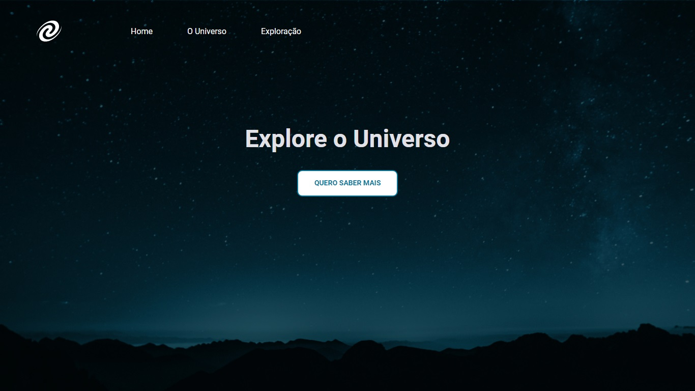

# Desafio Recriando Layout

Desafio do Stage06 que faz parte do Programa Explorer da Rocketseat  

💡 O que será abordado nesse desafio:  

- Conceitos de SPA;
- Mapeamento de rotas;
- Assíncrono e promises;
- Orientação a objetos;
- Classes e muito mais.

A ideia agora é criar o **SPA Universe**! 🚀   

## Screenshots

[🔗 Clique aqui para acessar o Projeto](https://fabiovascao.github.io/Projeto_Spa_Universe/) 
[🔗 Clique aqui para acessar o Figma](https://www.figma.com/file/ABznTcniEngJnSk8aoxdC2/Desafios-Explorer-SPA-Universe-Copy?fuid=1151137169943796805) 

## 🛠 Tecnologias

- HTML
- CSS
- Git e Github
- JavaScript
- Node.js

## Autor

- [@FabioVascão](https://www.github.com/fabiovascao)
